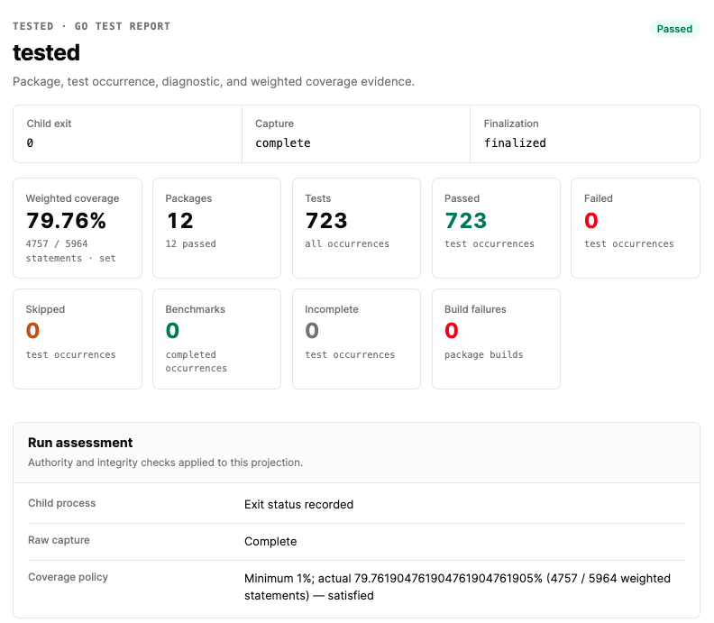

# tested

`tested` is a single-command Go test runner, coverage analyzer, and report
generator. It combines a `tparse`-style terminal summary with a self-contained
HTML test report, Go-authored annotated coverage HTML, machine-readable
summaries, and CI artifacts.



`tested` owns a stable `.coverage` artifact bundle containing human-readable
reports, machine-readable summaries, and the authoritative captured evidence.
A coherent, coverage-enabled live run normally produces:

```text
.coverage/
├── test_output.jsonl
├── stderr.log
├── run.json
├── coverage.out
├── coverage.html
├── test_output.html
├── summary.json
├── junit.xml
├── index.html
└── manifest.json
```

A successful generation omits the coverage pair with `--no-coverage`.
`coverage.html` is produced only from a valid profile; a nonempty invalid
`coverage.out` may remain as diagnostic evidence without HTML. Imported
offline bundles may omit unbound `stderr.log` or `coverage.out`.
`manifest.json` is published only for a coherent generation whose requested
reports completed; an ordinary test, build, or coverage-policy failure can
still be coherent and receive a manifest.

Unlike a `go test | tee` shell pipeline, `tested` retains the real child-process
exit status, understands both Go test and build events, preserves repeated test
occurrences, and cannot present stale coverage as a new successful run.

## Quick start

Install from source:

```bash
go install github.com/greenpau/tested@latest
```

Run every package in the current module:

```bash
tested
```

Pass exact arguments to `go test` after `--`:

```bash
tested run -- -race -count=1 ./...
tested run -- -run TestAuthentication ./...
tested run -C ../my-project -- -shuffle=on ./...
tested run --coverage-diff-base HEAD -- ./...
```

`--coverage-diff-base REV` adds an opt-in source comparison to
`coverage.html`. `REV` must resolve to exactly one commit already present in
the project repository. `tested` does not infer a base or fetch missing Git
objects. This option requires the local `git` executable; ordinary coverage
generation does not.

Regenerate derived reports without rerunning tests:

```bash
tested report
tested report -C ../my-project
tested report -C ../my-project --coverage-diff-base HEAD
tested report -C ../my-project \
  --events /archive/test_output.jsonl \
  --run-metadata /archive/run.json
```

External event, stderr, and profile evidence is copied byte-for-byte into
tested's canonical managed names before reporting. A matching external
`run.json` is strictly validated and canonically re-encoded; it can also select
bound sibling `stderr.log` and `coverage.out`. Stale managed companions that do
not belong to the selected bundle are removed. For a policy-free bundle,
`report --no-coverage` removes the profile binding while preserving the
authoritative child status and other bindings. A bundle with a recorded
coverage policy is incompatible with `report --no-coverage`; tested rejects
that request before changing the managed bundle.

Run `tested help` for the complete command reference.

## Reports

Each run produces primary evidence first and derives every presentation from
the same normalized result model.

| Artifact | Purpose |
| --- | --- |
| `test_output.jsonl` | Byte-faithful live stdout, or a byte-faithful imported event-log copy |
| `coverage.out` | Native Go coverage profile, live or imported when selected |
| `test_output.html` | Searchable, filterable, self-contained test report |
| `coverage.html` | Selected Go toolchain's annotated-source report with tested's fixed presentation layer |
| `summary.json` | Versioned, compact result for agents and CI |
| `junit.xml` | JUnit-compatible test result exchange |
| `stderr.log` | Byte-faithful live child stderr, or a selected imported copy |
| `run.json` | Strict `tested/run/v1` child status and raw-evidence bindings |
| `index.html` | Offline landing page linking only to managed reports that exist |
| `manifest.json` | Conditional inventory of completed artifacts, published last |

The three HTML entry points—`index.html`, `test_output.html`, and
`coverage.html`—share one compact, dependency-free operational theme. They are
responsive, honor the system dark-mode preference, expose visible keyboard
focus, retain semantic status colors, and print cleanly without fetching
remote assets. Their report-owned HTML, CSS, and JavaScript sources are
compiled into the binary with Go's `embed` package. The coverage page keeps the
selected Go toolchain's source annotation, coverage spans, file selector, and
script intact. An exactly removable head layer adds the viewport,
content-security policy, embedded presentation assets, package filtering,
uncovered-region focus, and expandable context. When
`--coverage-diff-base` is supplied, that layer also carries a bounded,
contextually escaped comparison model for genuine unified and split changes.
A changed-files switch then limits both package and file choices to modified,
added, renamed, and untracked covered sources.

Live raw evidence and imported evidence copies are never silently redacted.
Repeatable `--redact REGEXP` options apply to console output,
`test_output.html`, `summary.json`, `junit.xml`, and `index.html`. They do not
change `test_output.jsonl`, `stderr.log`, `coverage.out`, `coverage.html`,
`run.json`, or manifest hashes. `tested` accepts at most 32 expressions, 4096
bytes each and 32 KiB in total, and rejects expressions that match empty input.
A contextual zero-width match or a replacement that would grow a presentation
value beyond the larger of its original byte length and the fixed omission
marker omits that complete value and stops later redaction rules. This prevents
ordered expressions from amplifying output. The managed event-log copy remains
complete.

## Correctness model

- The `go test` process exit status is authoritative for a live run.
- Raw bytes are recorded before JSON interpretation.
- `run.json` is one strict, bounded `tested/run/v1` document. It records
  child/cancellation state, monotonic `duration_ns`, capture integrity, issues,
  exact coverage-policy evidence, and at most three unique size/SHA-256
  bindings for required `test_output.jsonl` plus retained `stderr.log` and
  `coverage.out`; duplicate JSON member names are rejected at every depth,
  signal cancellation accepts only the canonical interrupt/terminated exit
  mappings, and tested-written status encodes bindings in canonical name order.
- Offline mode verifies those bindings and never infers success from an
  unbound event stream.
- Go `TestEvent` and `BuildEvent` records remain distinguishable and correlated.
- Go 1.25 test attributes and Go 1.26 artifact-directory records retain their
  source sequence and package/test occurrence. Derived JSON, HTML, and JUnit
  reports redact their keys, values, and paths; artifact paths remain
  informational text and never become links.
- A test identity is package, full test name, and occurrence number. Runs from
  `-count`, `-cpu`, or repeated benchmarks are not merged.
- Every started occurrence ends as passed, failed, skipped, benchmarked, or
  explicitly incomplete.
- Global coverage is the statement-weighted profile total. Package percentages
  printed by `go test` are shown separately and never averaged.
- Derived files are written through same-directory temporary files and renamed
  into place. The manifest is the final coherence marker.
- On POSIX systems, a multiply-linked managed regular file is rejected before
  tested changes its permissions or hashes it. External evidence imports are
  copied to an independent managed file rather than chmodding the source.
- Package and test presentation order is deterministic even when execution is
  parallel.
- Cancellation targets the owned process tree, waits up to the default
  two-second graceful interval, then forces termination as needed while
  draining output and reaping the child.

## Replacing the legacy Makefile pipeline

The following:

```make
test:
	@go test -json -v -coverprofile=.coverage/coverage.out ./... \
		| tee .coverage/test_output.jsonl
	@go-test-report < .coverage/test_output.jsonl \
		-o .coverage/test_output.html
	@go tool cover -html=.coverage/coverage.out \
		-o .coverage/coverage.html
	@grep -q '"Action":"fail"' .coverage/test_output.jsonl && exit 1 || true
```

becomes:

```make
test:
	@tested run -- -v ./...
```

There are no runtime dependencies on `tparse`, `go-test-report`, or a shell.
The selected Go toolchain is still used for test execution and canonical
coverage HTML.

## Coverage policy

Fail a passing test run when weighted statement coverage is below a threshold:

```bash
tested run --minimum-coverage 80 -- ./...
```

The threshold input is limited to 256 bytes and its grammar is the exact ASCII
plain-decimal form `DIGIT+("."DIGIT+)?` in the inclusive range `0` through
`100`. Signs, whitespace, exponents, percent suffixes, NaN, and infinities are
rejected. Comparison uses the exact weighted statement ratio; equality passes
and display rounding never decides the exit status.

Package coverage observed in Go test events and authoritative profile coverage
answer different questions. `tested` labels them separately.

## Resource bounds

`--max-event-bytes` defaults to 16 MiB per decoded event and also bounds
aggregate temporary assembly of one fragmented Go benchmark result line.
`--max-test-output-bytes` defaults to 1 MiB independently for each test
occurrence, package, build, and unattributed output scope in derived reports.
`--max-total-output-bytes` adds a 64 MiB run-wide retained-output budget, and
`--max-result-entries` limits normalized entities and retained chunks to
1,000,000. `--max-normalized-bytes` separately limits retained identity and
metadata strings to 128 MiB, preventing many small records from creating an
unbounded semantic projection. Zero explicitly disables any of these bounds;
nonzero byte limits must be at least 1024 bytes. These limits never truncate
the managed event log. Exhausting an entity or normalized-string budget marks
the derived result incomplete; clipping derived output alone is reported as
presentation loss because the raw log remains authoritative.
Fragmented benchmark assembly retains a fixed fragment-count safety limit even
when its byte bound is disabled.
Each decoded event additionally permits at most 64 fields unknown to its
selected schema and 64 KiB total decoded unknown-field names plus exact
retained JSON values. Exceeding either extension bound or repeating a decoded
JSON member name makes that record malformed while its raw bytes remain
preserved.
Coverage parsing independently caps one profile at 256 MiB, 100,000 unique
source files, and 1,000,000 unique blocks; these conservative parser limits
protect both live and imported evidence processing.

## Exit codes

| Code | Meaning |
| --- | --- |
| `0` | The command completed successfully under the requested policy |
| `1` | Tests or a package build failed and failures were not allowed |
| `2` | Usage, execution, unavailable required coverage, integrity, or reporting failed |
| `3` | A coherent successful child run was below the exact coverage minimum |
| `130` | SIGINT, deadline, or programmatic cancellation |
| `143` | SIGTERM cancellation |

If the Go command returns another nonzero status or terminates from a signal,
`tested` preserves its authoritative status instead of normalizing it to 1.
Cancellation has highest precedence. The same cancellation projection applies
while regenerating reports; a cancelled report does not publish a manifest.

When tests and report generation both fail, both are diagnosed and the
authoritative child test status wins.

## Security

Test output and annotated coverage source can contain credentials, private file
paths, request data, and implementation details. `tested` creates the artifact
directory with mode `0700` and files with mode `0600`, rejects symlink report
targets, and HTML-escapes all untrusted content. Review and redact reports
before uploading them to shared CI storage. With `--coverage-diff-base`, the
report can also embed source from the selected commit, including deleted lines
that no longer exist in the working tree; treat that baseline source as
equally sensitive.

See [USER_GUIDE.md](USER_GUIDE.md) for operating details and
[SECURITY.md](SECURITY.md) for the report threat model.

## Development

The module requires Go 1.25 or newer and uses only the Go standard library.
All development targets run with Go 1.25. On Go 1.26 or newer, `make e2e`
additionally verifies the version-specific artifact-directory and BuildEvent
records; Go 1.25 reports those assertions as explicitly skipped.

`make test` first runs direct formatting, vet, unit, race, and shuffled checks
as the bootstrap authority. It then builds the checked-out source as
`bin/tested` and uses that binary for one canonical `-count=1` self-test.
The successful self-test leaves a validated ten-file `.coverage` bundle at the
repository root. `make self-test` runs only that build-and-report stage;
`make coverage` is an alias for the complete `make test` contract. Use
`make clean` to remove the generated binary and reports.

```bash
make skills-check
make test
make self-test
make e2e
make cross-build
make ci
make release-check
make release
```

`make release` is an operator-controlled publication workflow modeled on the
other Greenpau Go repositories. From a clean `main` branch, it requires the
pinned `versioned` 1.0.36 tool, confirms that the next patch tag is absent
locally and on `origin`, runs the complete `release-check`, increments
`VERSION`, creates a repository-compliant release commit and annotated tag,
then atomically pushes only `main` and that tag. The tag starts the GitHub
release workflow. Do not invoke this target from CI or while unrelated work is
present.

Repository engineering contracts begin in [AGENTS.md](AGENTS.md) and route to
the focused skills under `.codex/skills`.

## License

`tested` is licensed under the Apache License 2.0.
